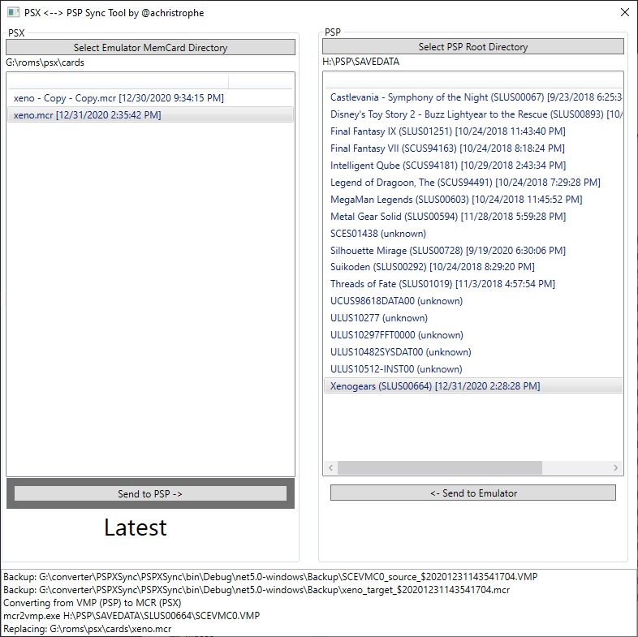

### PSX <----> PSP Synchronization Ultility
Autoconvert between VMP (PSP memory card format) and MCR (PSX memory card format) - bi-directional.

#### Credits:
Mad props to [@dots-tb](https://github.com/dots-tb) for the [vita-mcr2vmp](https://github.com/dots-tb/vita-mcr2vmp) used within this application.
#### Goal:
I wanted to play PS1 games both on the big screen and portably on the PSP with minimal hassle to managing save files. I wanted an easy way to plug a PSP into a PC via USB and with one button transfer between the PSP and an emulator like [PSX](https://github.com/GPUCode/PSXemu) or [ePSXe](https://www.epsxe.com/). The complication is a file conversion must occur between MCR (PSX memory card format) and VMP (PSP memory card format).

This application simply automatically takes care of that by knowing which direction you are sending your save file.

Simply..
1. Select the PSX memory card directory (you may select the root, it will auto-detect "cards" folder for PSX or "memcards for ePSXe )
2. Select the root of the PSP via USB (it will auto-detect the LETTER\PSP\SAVEDATA director)
3. Select one PSX memory card 
4. Select one folder from PSP (this will auto-populate game ID lookups, currently SCUS only atm)
5. Click either "Send to PSP" or "Send to Emulator"

All directory and selections are saved on relaunch. The program will check the modified timestamps to recommend what is the "Latest" save file and the predicted direction you may want to send the save. 

Theoretically this should work for VITA, but that is untested.

### Alternatives
If you're not using a PSP/vita device, check out [PPSSPP](https://www.ppsspp.org) emulator.